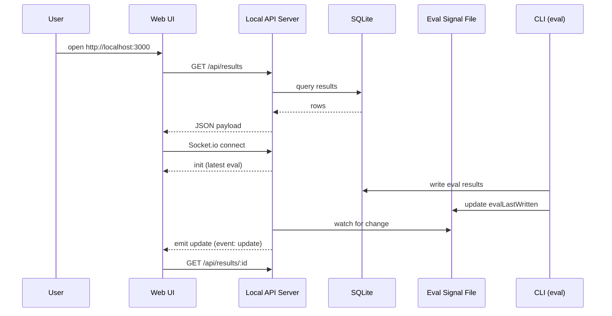
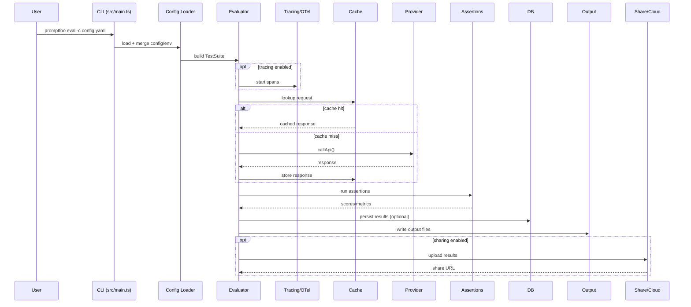
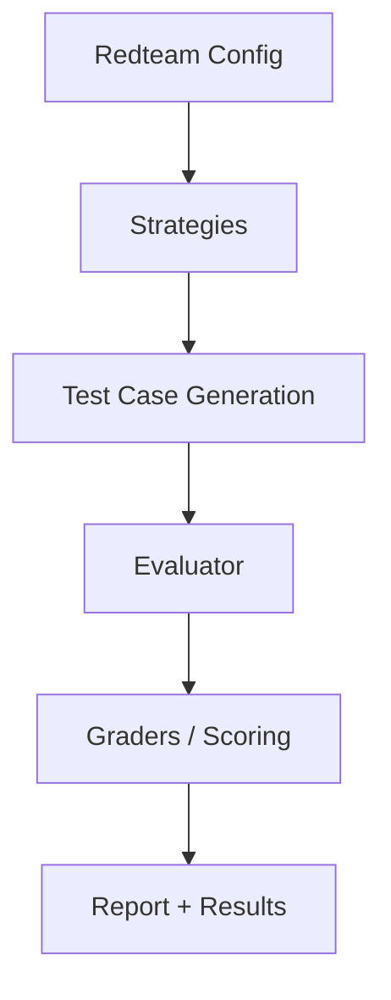
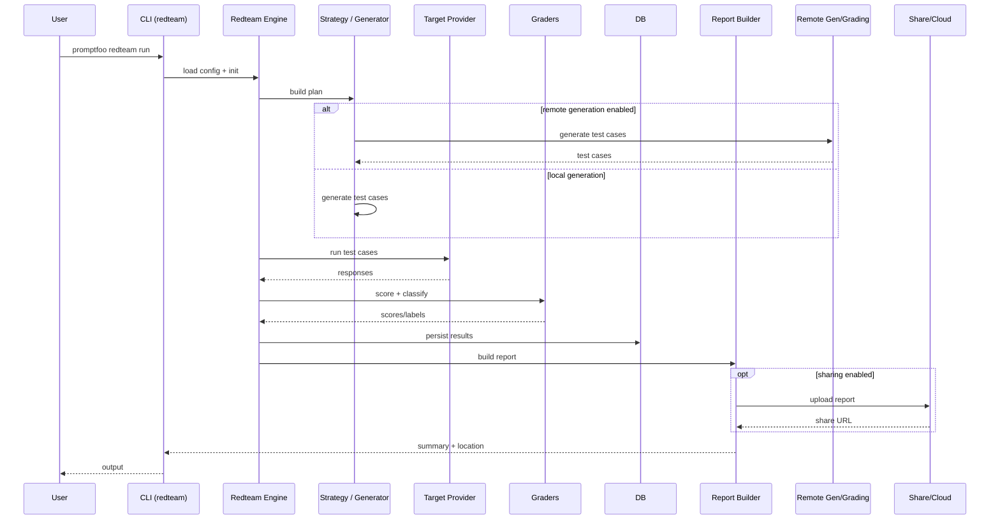
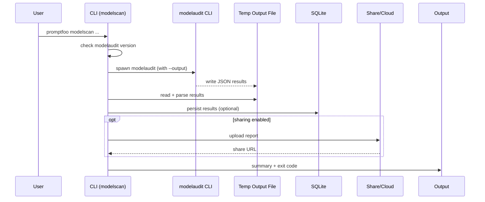

# Promptfoo 架构概览

本文档聚焦仓库级架构与核心运行路径，帮助快速理解 Promptfoo 的组件边界、数据流与扩展点。

## 目录结构速览

- `src/`: 核心库与运行时逻辑（评测、断言、providers、redteam、code scan 等）
- `src/commands/`: CLI 命令注册与实现
- `src/server/`: 本地 API Server（Express + Socket.io）
- `src/app/`: Web UI（React 19 + Vite）
- `src/providers/`: 各类模型/服务 provider 适配
- `src/redteam/`: 红队测试引擎与插件/策略
- `src/codeScan/`: 代码扫描与模型审计相关逻辑
- `drizzle/`: 数据库迁移
- `test/`: Vitest 测试
- `site/`: 文档站点（Docusaurus）
- `examples/`: 评测/配置示例

## 关键入口

- CLI 入口：`src/entrypoint.ts` → `src/main.ts`
- 库入口：`src/index.ts`
- 本地服务：`src/server/index.ts` → `src/server/server.ts`
- Web UI：`src/app/`（Vite 构建产物由 server 静态托管）

## 高层架构

```mermaid
flowchart LR
    User[User / CI] --> CLI[promptfoo CLI]
    CLI --> Core[Core Library]
    CLI --> MCPServer[MCP Server]
    MCPClients[MCP Clients] --> MCPServer
    MCPServer --> Core

    Core --> Providers[Providers]
    Providers --> LLMs[LLM APIs / External Services]

    Core --> Assertions[Assertions / Scoring]
    Core --> Redteam[Redteam Engine]
    Core --> CodeScan[Code Scan]
    CodeScan --> PromptfooAPI[Promptfoo API (Socket.io)]

    Core --> Cache[(Cache)]
    Core --> DB[(SQLite + Drizzle)]
    Core --> Files[(Output Files)]

    Server[Local API Server] --> DB
    Server --> Core
    WebUI[Web UI (src/app)] --> Server
    WebUI <-->|Socket.io| Server

    CLI -.->|optional| Telemetry[Telemetry / Updates]
    Core -.->|optional| Share[Share / Cloud]
    Redteam -.->|optional| RemoteGen[Remote Gen / Grading]
    Core -.->|optional| Tracing[Tracing / OTel]
```

## 运行场景

### CLI-only（最常见）

- 运行 `promptfoo eval` 或 `promptfoo redteam ...`，由 CLI 直接调用核心库。
- 结果按配置写入输出文件，启用 `--write` 时写入 SQLite。
- 可选启用缓存、分享（sharing）、Tracing。

### Server + Web UI

- 启动本地 server 与 Web UI（开发或查看模式）。
- Web UI 通过 REST + Socket.io 读取结果并实时刷新。
- 评测仍由 CLI 触发，UI 主要负责可视化与浏览结果。

#### Web UI 查看结果时序



### MCP Server 模式

- `promptfoo mcp` 启动 MCP server。
- 外部 MCP 客户端调用工具（eval、redteam、dataset 等）。
- 结果与 CLI 模式一致，可写入 DB/文件。

### Library 集成

- 在代码中 `import { evaluate } from 'promptfoo'` 直接嵌入评测。
- 适合自定义 pipeline、CI 或服务端编排。

## 评测（eval）主流程



## Redteam 流程（简化）



## Redteam 流程（详细交互）



## Code Scan 流程（详细交互）

```mermaid
sequenceDiagram
    participant User
    participant CLI as CLI (code-scans)
    participant Scanner as Code Scan Runner
    participant Git as Git/Diff
    participant MCP as MCP FS Server
    participant API as Promptfoo API
    participant Output as Output

    User->>CLI: promptfoo code-scans run
    CLI->>Scanner: executeScan()
    Scanner->>Git: collect diffs + metadata
    Scanner->>API: connect Socket.io

    alt diffs-only
        Scanner->>API: emit scan:start (diffs only)
    else diffs + repo context
        Scanner->>MCP: start filesystem server
        MCP<->>API: socket bridge
        Scanner->>API: emit scan:start (diffs + context)
    end

    API-->>Scanner: scan:complete (findings)
    Scanner->>Output: pretty print / JSON
    opt github-pr provided
        Scanner->>API: include PR context
        API-->>Scanner: comments posted
    end
```

## Model Audit 流程（外部工具）



## 核心子系统说明

**核心库（`src/`）**
- 评测引擎：`src/evaluator.ts` 负责调度 provider、断言与并发执行。
- 配置与模板：`src/prompts/`、`src/util/config/` 负责配置加载、模板渲染与用例解析。
- 断言/评分：`src/assertions/` 提供多类型断言、打分与指标汇总。
- Providers：`src/providers/` 统一不同厂商/模型的调用接口。
- Redteam：`src/redteam/` 提供策略、插件、提取器与评分器。
- Code Scan：`src/codeScan/` 用于代码扫描与模型审计相关逻辑。
- MCP：`src/commands/mcp/` 启动 MCP server，便于外部工具集成。
- Tracing：`src/tracing/` 提供 OTel tracing 与 exporter 支持。
- Telemetry/Updates：`src/telemetry.ts`、`src/updates.ts` 记录命令使用并检查更新。

**本地服务（`src/server/`）**
- Express 提供 API（结果、历史、配置等），Socket.io 提供实时更新。
- 静态托管 `src/app` 构建产物，作为 Web UI 展示层。

**Web UI（`src/app/`）**
- React 19 + Vite 构建，默认通过 API Server 访问后端能力。
- Web UI 依赖 Socket.io 获取实时状态与更新。

## 数据与存储

- SQLite（Drizzle ORM）：评测结果、历史与相关元数据（见 `src/database/`）。
- 缓存：`src/cache.ts` 提供磁盘或内存缓存，降低重复请求成本。
- 输出文件：支持 JSON/表格等多种输出格式（`src/util/exportToFile/`）。

## 外部集成（可选）

- Share/Cloud：`src/share.ts` + `src/globalConfig/cloud.ts` 用于分享结果与云端配置。
- Remote Generation/Grading：`src/redteam/remoteGeneration.ts` 支持远程生成与评分。
- Tracing/OTel：可接入本地或远程 OTel collector。
- Telemetry/Updates：命令统计与版本更新检查。
- Promptfoo API（Code Scan）：Socket.io 扫描通道与可选 PR 评论。

## API 路由清单（全量）

下表按 router 列出所有 REST 路由，并标注关键 query/body 字段与关键响应字段。schema 引用优先 `ApiSchemas.*`，其余为类型或路由内 zod。

### 基础路由（`src/server/server.ts`）

| Method | Path | Purpose | Key params | Key response fields | Schema refs |
| --- | --- | --- | --- | --- | --- |
| GET | `/health` | 健康检查 | — | `status`, `version` | route-local |
| GET | `/api/remote-health` | 远程健康检查 | — | `status`, `message` | route-local |
| GET | `/api/results` | eval 列表 | query: `datasetId?`, `type?`, `includeProviders?` | `data[]` | `EvalSummary` |
| GET | `/api/results/:id` | eval 详情 | params: `id` | `data` | `ResultsFile` |
| GET | `/api/prompts` | prompts 列表 | — | `data[]` | `PromptWithMetadata` |
| GET | `/api/history` | eval 历史 | query: `tagName?`, `tagValue?`, `description?` | `data[]` | route-local |
| GET | `/api/prompts/:sha256hash` | prompts by hash | params: `sha256hash` | `data[]` | `PromptWithMetadata` |

### `/api/eval`（`src/server/routes/eval.ts`）

| Method | Path | Purpose | Key params | Key response fields | Schema refs |
| --- | --- | --- | --- | --- | --- |
| POST | `/api/eval/job` | 启动 eval 任务 | body: `prompts`, `providers`, `tests`, `evaluateOptions` | `id` | `EvaluateTestSuiteWithEvaluateOptions`, `Job` |
| GET | `/api/eval/job/:id` | 查询任务状态 | params: `id` | `status`, `progress`, `total`, `result?`, `evalId?`, `logs` | `Job` |
| PATCH | `/api/eval/:id` | 更新 table/config | params: `id`, body: `table?`, `config?` | `message` | route-local |
| PATCH | `/api/eval/:id/author` | 更新作者 | params: `id`, body: `author` | `message` | `ApiSchemas.Eval.UpdateAuthor.*` |
| GET | `/api/eval/:id/table` | 获取表格/导出 | query: `format?`, `limit`, `offset`, `filterMode`, `search`, `filter[]`, `comparisonEvalIds[]` | `table`, `totalCount`, `filteredCount`, `filteredMetrics` | `EvalTableDTO`, `evalTableQuerySchema` |
| GET | `/api/eval/:id/metadata-keys` | metadata keys | params: `id`, query: `comparisonEvalIds[]` | `keys[]` | `ApiSchemas.Eval.MetadataKeys.*` |
| GET | `/api/eval/:id/metadata-values` | metadata values | params: `id`, query: `key` | `values[]` | `ApiSchemas.Eval.MetadataValues.*` |
| POST | `/api/eval/:id/results` | 写入结果 | params: `id`, body: `EvalResult[]` | 204 (no body) | `EvalResult` (model) |
| POST | `/api/eval/replay` | 复播单条用例 | body: `evaluationId`, `prompt`, `variables?`, `testIndex?` | `output`, `error?`, `response?` | route-local |
| POST | `/api/eval/:evalId/results/:id/rating` | 人工评分 | params: `evalId`, `id`, body: `GradingResult` | `EvalResult` | `GradingResult` |
| POST | `/api/eval` | 写入 eval | body: `data` (ResultsFile) or `Eval` | `id` | `ResultsFile`, `Eval` (model) |
| DELETE | `/api/eval/:id` | 删除 eval | params: `id` | `message` | route-local |
| DELETE | `/api/eval` | 批量删除 | body: `ids[]` | 204 (no body) | route-local |
| POST | `/api/eval/:id/copy` | 复制 eval | params: `id`, body: `description?` | `id`, `distinctTestCount` | `ApiSchemas.Eval.Copy.*` |

### `/api/redteam`（`src/server/routes/redteam.ts`）

| Method | Path | Purpose | Key params | Key response fields | Schema refs |
| --- | --- | --- | --- | --- | --- |
| POST | `/api/redteam/generate-test` | 生成测试用例 | body: `plugin.id`, `strategy.id`, `config.applicationDefinition.purpose?`, `count?` | `prompt`/`context`/`metadata` or `testCases[]` | `TestCaseGenerationSchema` |
| POST | `/api/redteam/run` | 启动 redteam | body: `config`, `force?`, `verbose?`, `delay?`, `maxConcurrency?` | `id` | route-local |
| POST | `/api/redteam/cancel` | 取消运行 | — | `message` | route-local |
| POST | `/api/redteam/:taskId` | 云端 task 代理 | params: `taskId`, body: passthrough | cloud response | route-local |
| GET | `/api/redteam/status` | 当前任务状态 | — | `hasRunningJob`, `jobId` | route-local |

### `/api/providers`（`src/server/routes/providers.ts`）

| Method | Path | Purpose | Key params | Key response fields | Schema refs |
| --- | --- | --- | --- | --- | --- |
| GET | `/api/providers` | providers 列表 | — | `success`, `data.providers`, `data.hasCustomConfig` | route-local |
| GET | `/api/providers/config-status` | 是否有自定义 providers | — | `success`, `data.hasCustomConfig` | route-local |
| POST | `/api/providers/test` | 测试 provider | body: `providerOptions`, `prompt?` | `testResult`, `providerResponse`, `transformedRequest?` | `TestPayloadSchema`, `ProviderOptionsSchema`, `ProviderTestResponse` |
| POST | `/api/providers/discover` | 目标用途发现 | body: `providerOptions` | `purpose`, `limitations`, `user`, `tools` | `ProviderOptionsSchema`, `TargetPurposeDiscoveryResult` |
| POST | `/api/providers/http-generator` | 生成 HTTP 配置 | body: `requestExample`, `responseExample?` | config payload (cloud response) | route-local |
| POST | `/api/providers/test-request-transform` | 测试请求 transform | body: `transformCode?`, `prompt` | `success`, `result?`, `error?` | `TestRequestTransformSchema` |
| POST | `/api/providers/test-response-transform` | 测试响应 transform | body: `transformCode?`, `response` | `success`, `result?`, `error?` | `TestResponseTransformSchema` |
| POST | `/api/providers/test-session` | 测试 session | body: `provider`, `sessionConfig?`, `mainInputVariable?` | `success`, `message`, `details?` | route-local |

### `/api/configs`（`src/server/routes/configs.ts`）

| Method | Path | Purpose | Key params | Key response fields | Schema refs |
| --- | --- | --- | --- | --- | --- |
| GET | `/api/configs` | 列表（可按 type） | query: `type?` | `configs[]` | route-local |
| POST | `/api/configs` | 创建配置 | body: `name`, `type`, `config` | `id`, `createdAt` | route-local |
| GET | `/api/configs/:type` | 列表（按 type） | params: `type` | `configs[]` | route-local |
| GET | `/api/configs/:type/:id` | 获取配置 | params: `type`, `id` | config record | route-local |

### `/api/model-audit`（`src/server/routes/modelAudit.ts`）

| Method | Path | Purpose | Key params | Key response fields | Schema refs |
| --- | --- | --- | --- | --- | --- |
| GET | `/api/model-audit/check-installed` | CLI 可用性 | — | `installed`, `version`, `cwd` | route-local |
| POST | `/api/model-audit/check-path` | 校验路径 | body: `path` | `exists`, `type`, `absolutePath?`, `name?` | route-local |
| POST | `/api/model-audit/scan` | 扫描模型 | body: `paths[]`, `options.timeout?`, `options.persist?` | `has_errors`, `issues`, `auditId?`, `persisted?` | `ModelAuditScanConfig`, `ModelAuditScanResults` |
| GET | `/api/model-audit/scans` | 列表 | query: `limit?`, `offset?`, `sort?`, `order?`, `search?` | `scans[]`, `total`, `limit`, `offset` | route-local |
| GET | `/api/model-audit/scans/latest` | 最新扫描 | — | audit JSON | `ModelAudit` (model) |
| GET | `/api/model-audit/scans/:id` | 扫描详情 | params: `id` | audit JSON | `ModelAudit` (model) |
| DELETE | `/api/model-audit/scans/:id` | 删除扫描 | params: `id` | `success`, `message` | route-local |

### `/api/traces`（`src/server/routes/traces.ts`）

| Method | Path | Purpose | Key params | Key response fields | Schema refs |
| --- | --- | --- | --- | --- | --- |
| GET | `/api/traces/evaluation/:evaluationId` | eval traces | params: `evaluationId` | `traces[]` | route-local |
| GET | `/api/traces/:traceId` | trace 详情 | params: `traceId` | `trace` | route-local |

### `/api/blobs`（`src/server/routes/blobs.ts`）

| Method | Path | Purpose | Key params | Key response fields | Schema refs |
| --- | --- | --- | --- | --- | --- |
| GET | `/api/blobs/:hash` | 获取 blob | params: `hash` | binary or redirect | route-local |

### `/api/media`（`src/server/routes/media.ts`）

| Method | Path | Purpose | Key params | Key response fields | Schema refs |
| --- | --- | --- | --- | --- | --- |
| GET | `/api/media/stats` | 存储统计 | — | `success`, `data.providerId` | route-local |
| GET | `/api/media/info/:type/:filename` | 媒体信息 | params: `type`, `filename` | `success`, `data.key`, `data.exists`, `data.url` | route-local |
| GET | `/api/media/:type/:filename` | 媒体内容 | params: `type`, `filename` | binary | route-local |

### `/api/user`（`src/server/routes/user.ts`）

| Method | Path | Purpose | Key params | Key response fields | Schema refs |
| --- | --- | --- | --- | --- | --- |
| GET | `/api/user/email` | 获取邮箱 | — | `email` | `ApiSchemas.User.Get.Response` |
| GET | `/api/user/id` | 获取用户 ID | — | `id` | `ApiSchemas.User.GetId.Response` |
| POST | `/api/user/email` | 设置邮箱 | body: `email` | `success`, `message` | `ApiSchemas.User.Update.*` |
| PUT | `/api/user/email/clear` | 清除邮箱 | — | `success`, `message` | route-local |
| GET | `/api/user/email/status` | 邮箱状态 | query: `validate?` | `hasEmail`, `status`, `email?`, `message?` | `ApiSchemas.User.EmailStatus.Response` |
| POST | `/api/user/login` | API key 登录 | body: `apiKey`, `apiHost?` | `success`, `user`, `organization`, `app` | route-local (inline zod) |
| POST | `/api/user/logout` | 登出 | — | `success`, `message` | route-local |
| GET | `/api/user/cloud-config` | 云端配置状态 | — | `appUrl`, `isEnabled` | route-local |

### `/api/version`（`src/server/routes/version.ts`）

| Method | Path | Purpose | Key params | Key response fields | Schema refs |
| --- | --- | --- | --- | --- | --- |
| GET | `/api/version` | 版本信息 | — | `currentVersion`, `latestVersion`, `updateAvailable`, `updateCommands` | route-local |

### Socket.io 事件

| Event | Payload fields | Response/event | Schema refs | Source |
| --- | --- | --- | --- | --- |
| `init` | payload: latest eval | — | `Eval` (model) | `src/server/server.ts` |
| `update` | payload: updated eval | — | `Eval` (model) | `src/server/server.ts` |
| `scan:session` | payload: `sessionId` | — | route-local | `src/codeScan/scanner/index.ts` |
| `scan:start` | payload: `ScanRequest` | emits `scan:complete` / `scan:error` | `ScanRequest` | `src/codeScan/scanner/request.ts` |
| `scan:complete` | payload: `ScanResponse` | — | `ScanResponse` | `src/codeScan/scanner/request.ts` |
| `scan:error` | payload: `error`, `message` | — | route-local | `src/codeScan/scanner/request.ts` |
| `scan:cancel` | payload: — | aborts scan | route-local | `src/codeScan/scanner/request.ts` |

## API 示例（精选）

以下仅为示例，完整路由与 schema 见上方“API 路由清单（全量）”。

### `/api/results`

```http
GET /api/results?type=eval&includeProviders=true
```

```json
{
  "data": [
    {
      "evalId": "eval_123",
      "datasetId": null,
      "createdAt": 1720000000000,
      "description": "my eval",
      "numTests": 42,
      "label": "My Eval",
      "isRedteam": false,
      "passRate": 0.85,
      "providers": [
        {
          "id": "openai:gpt-4o-mini",
          "label": "gpt-4o-mini"
        }
      ]
    }
  ]
}
```

### `/api/eval`

```http
POST /api/eval/job
Content-Type: application/json
```

```json
{
  "prompts": ["Hello {{input}}"],
  "providers": ["openai:gpt-4o-mini"],
  "tests": [{ "vars": { "input": "world" } }],
  "evaluateOptions": { "cache": false }
}
```

```json
{ "id": "job_123" }
```

```http
GET /api/eval/job/job_123
```

```json
{
  "status": "in-progress",
  "progress": 1,
  "total": 5,
  "logs": []
}
```

### `/api/redteam`

```http
POST /api/redteam/generate-test
Content-Type: application/json
```

```json
{
  "plugin": { "id": "pii:direct", "config": {} },
  "strategy": { "id": "default", "config": {} },
  "config": { "applicationDefinition": { "purpose": "support bot" } },
  "count": 1
}
```

```json
{
  "prompt": "...",
  "context": "...",
  "metadata": {}
}
```

### `/api/model-audit`

```http
POST /api/model-audit/scan
Content-Type: application/json
```

```json
{
  "paths": ["~/models/foo"],
  "options": { "persist": true, "timeout": 3600 }
}
```

```json
{
  "has_errors": false,
  "issues": [],
  "auditId": "audit_123",
  "persisted": true
}
```

### `/api/providers`

```http
GET /api/providers
```

```json
{
  "success": true,
  "data": {
    "providers": ["openai:gpt-4o-mini"],
    "hasCustomConfig": false
  }
}
```

### `/api/traces`

```http
GET /api/traces/evaluation/eval_123
```

```json
{ "traces": [] }
```

### `/api/configs`

```http
POST /api/configs
Content-Type: application/json
```

```json
{
  "name": "My Config",
  "type": "redteam",
  "config": { "foo": "bar" }
}
```

```json
{ "id": "cfg_123", "createdAt": "2024-07-01T12:00:00.000Z" }
```

### `/api/blobs`

```http
GET /api/blobs/<sha256>
```

```http
HTTP/1.1 302 Found
Location: https://storage.example.com/...
```

### `/api/media`

```http
GET /api/media/info/audio/abc123.mp3
```

```json
{
  "success": true,
  "data": {
    "key": "audio/abc123.mp3",
    "exists": true,
    "url": "http://localhost:3000/api/media/audio/abc123.mp3"
  }
}
```

### `/api/user`

```http
GET /api/user/email
```

```json
{ "email": "user@example.com" }
```

### `/api/version`

```http
GET /api/version
```

```json
{
  "currentVersion": "0.120.14",
  "latestVersion": "0.120.14",
  "updateAvailable": false,
  "selfHosted": false,
  "isNpx": false,
  "updateCommands": {
    "commandType": "npm",
    "commands": ["npm i -g promptfoo@latest"]
  },
  "commandType": "npm"
}
```

## 数据契约（核心 JSON 结构）

**Eval Summary（/api/results）**
Type: `EvalSummary` (`src/types/index.ts`)
```json
{
  "data": [
    {
      "evalId": "eval_123",
      "datasetId": null,
      "createdAt": 1720000000000,
      "description": "my eval",
      "numTests": 42,
      "label": "My Eval",
      "isRedteam": false,
      "passRate": 0.85,
      "providers": [
        {
          "id": "openai:gpt-4o-mini",
          "label": "gpt-4o-mini"
        }
      ]
    }
  ]
}
```

**Eval Result（/api/results/:id）**
Type: `ResultsFile` (`src/types/index.ts`)
```json
{
  "data": {
    "version": 1,
    "createdAt": "2024-07-01T12:00:00.000Z",
    "results": {
      "version": 3,
      "timestamp": "2024-07-01T12:00:00.000Z",
      "results": [],
      "prompts": [],
      "stats": {
        "successes": 0,
        "failures": 0,
        "errors": 0,
        "tokenUsage": {
          "prompt": 0,
          "completion": 0,
          "cached": 0,
          "total": 0,
          "numRequests": 0,
          "completionDetails": {},
          "assertions": {
            "total": 0,
            "prompt": 0,
            "completion": 0,
            "cached": 0,
            "numRequests": 0,
            "completionDetails": {}
          }
        }
      }
    },
    "config": {},
    "author": null,
    "prompts": [],
    "datasetId": null
  }
}
```

**Code Scan Response（scan:complete）**
Type: `ScanResponse` (`src/types/codeScan.ts`)
```json
{
  "success": true,
  "review": "Summary text",
  "comments": [
    {
      "file": "src/foo.ts",
      "startLine": 8,
      "line": 10,
      "finding": "Potential prompt injection",
      "fix": "Sanitize input",
      "severity": "high",
      "aiAgentPrompt": "..."
    }
  ],
  "commentsPosted": true,
  "batchCount": 1
}
```

**Model Audit Results（modelaudit JSON）**
Type: `ModelAuditScanResults` (`src/types/modelAudit.ts`)
```json
{
  "has_errors": false,
  "bytes_scanned": 123456,
  "files_scanned": 12,
  "issues": [
    {
      "severity": "warning",
      "message": "Suspicious pickle file",
      "location": "model.pkl",
      "why": "Pickle can execute code",
      "timestamp": 1720000000
    }
  ],
  "checks": [
    {
      "name": "file_hashes",
      "status": "passed",
      "message": "Hashes computed"
    }
  ],
  "duration": 2.34,
  "scanner_names": ["modelaudit"],
  "content_hash": "abc123"
}
```

## 类型映射（Type Map）

| Type | Defined In | Used By |
| --- | --- | --- |
| `EvalSummary` | `src/types/index.ts` | `/api/results` |
| `ResultsFile` | `src/types/index.ts` | `/api/results/:id` |
| `PromptWithMetadata` | `src/types/index.ts` | `/api/prompts`, `/api/prompts/:sha256hash` |
| `EvaluateSummaryV3` | `src/types/index.ts` | eval 结果结构 |
| `EvalTableDTO` | `src/types/index.ts` | `GET /api/eval/:id/table` |
| `Job` | `src/types/index.ts` | `/api/eval/job`, `/api/redteam/run` |
| `Eval` (model) | `src/models/eval.ts` | Socket.io `init`/`update`, legacy `POST /api/eval` |
| `GradingResult` | `src/types/index.ts` | `POST /api/eval/:evalId/results/:id/rating` |
| `EvalResult` (model) | `src/models/evalResult.ts` | `/api/eval/:id/results`, `/api/eval/:evalId/results/:id/rating` |
| `PromptMetrics` | `src/types/index.ts` | eval 表格与过滤指标 |
| `ScanRequest` | `src/types/codeScan.ts` | `scan:start` |
| `ScanResponse` | `src/types/codeScan.ts` | `scan:complete` |
| `Comment` | `src/types/codeScan.ts` | code scan findings |
| `ModelAuditScanResults` | `src/types/modelAudit.ts` | `/api/model-audit/scan` |
| `ModelAuditIssue` | `src/types/modelAudit.ts` | model audit issues |
| `ModelAuditScanConfig` | `src/types/modelAudit.ts` | model audit request shape |
| `ModelAudit` (model) | `src/models/modelAudit.ts` | `/api/model-audit/scans*` |
| `ProviderOptions` | `src/types/providers.ts` | `/api/providers/test`, `/api/providers/discover` |
| `ProviderTestResponse` | `src/types/providers.ts` | `/api/providers/test` |
| `SessionTestResult` | `src/validators/testProvider.ts` | `/api/providers/test-session` |
| `TargetPurposeDiscoveryResult` | `src/redteam/commands/discover.ts` | `/api/providers/discover` |

## Schema Glossary（ApiSchemas + 路由内 Zod）

| Schema | Defined In | Used By | Notes |
| --- | --- | --- | --- |
| `ApiSchemas.User.Get.Response` | `src/server/apiSchemas.ts` | `GET /api/user/email` | `email` 响应 |
| `ApiSchemas.User.GetId.Response` | `src/server/apiSchemas.ts` | `GET /api/user/id` | `id` 响应 |
| `ApiSchemas.User.Update.Request` | `src/server/apiSchemas.ts` | `POST /api/user/email` | `email` 请求 |
| `ApiSchemas.User.Update.Response` | `src/server/apiSchemas.ts` | `POST /api/user/email` | `success`, `message` |
| `ApiSchemas.User.EmailStatus.Response` | `src/server/apiSchemas.ts` | `GET /api/user/email/status` | `status`, `message?` |
| `ApiSchemas.Eval.UpdateAuthor.Params` | `src/server/apiSchemas.ts` | `PATCH /api/eval/:id/author` | `id` 路径参数 |
| `ApiSchemas.Eval.UpdateAuthor.Request` | `src/server/apiSchemas.ts` | `PATCH /api/eval/:id/author` | `author` 请求 |
| `ApiSchemas.Eval.UpdateAuthor.Response` | `src/server/apiSchemas.ts` | `PATCH /api/eval/:id/author` | `message` 响应 |
| `ApiSchemas.Eval.MetadataKeys.Params` | `src/server/apiSchemas.ts` | `GET /api/eval/:id/metadata-keys` | `id` 路径参数 |
| `ApiSchemas.Eval.MetadataKeys.Query` | `src/server/apiSchemas.ts` | `GET /api/eval/:id/metadata-keys` | `comparisonEvalIds[]` |
| `ApiSchemas.Eval.MetadataKeys.Response` | `src/server/apiSchemas.ts` | `GET /api/eval/:id/metadata-keys` | `keys[]` 响应 |
| `ApiSchemas.Eval.MetadataValues.Params` | `src/server/apiSchemas.ts` | `GET /api/eval/:id/metadata-values` | `id` 路径参数 |
| `ApiSchemas.Eval.MetadataValues.Query` | `src/server/apiSchemas.ts` | `GET /api/eval/:id/metadata-values` | `key` 查询参数 |
| `ApiSchemas.Eval.MetadataValues.Response` | `src/server/apiSchemas.ts` | `GET /api/eval/:id/metadata-values` | `values[]` 响应 |
| `ApiSchemas.Eval.Copy.Params` | `src/server/apiSchemas.ts` | `POST /api/eval/:id/copy` | `id` 路径参数 |
| `ApiSchemas.Eval.Copy.Request` | `src/server/apiSchemas.ts` | `POST /api/eval/:id/copy` | `description?` 请求 |
| `ApiSchemas.Eval.Copy.Response` | `src/server/apiSchemas.ts` | `POST /api/eval/:id/copy` | `id`, `distinctTestCount` |
| `evalTableQuerySchema` | `src/server/routes/eval.ts` | `GET /api/eval/:id/table` | 表格过滤/分页查询 |
| `TestCaseGenerationSchema` | `src/server/routes/redteam.ts` | `POST /api/redteam/generate-test` | plugin/strategy/config |
| `TestPayloadSchema` | `src/server/routes/providers.ts` | `POST /api/providers/test` | `prompt`, `providerOptions` |
| `TestRequestTransformSchema` | `src/server/routes/providers.ts` | `POST /api/providers/test-request-transform` | `transformCode`, `prompt` |
| `TestResponseTransformSchema` | `src/server/routes/providers.ts` | `POST /api/providers/test-response-transform` | `transformCode`, `response` |
| inline login schema | `src/server/routes/user.ts` | `POST /api/user/login` | `apiKey`, `apiHost?` |

## 扩展点

- Providers：新增 provider 适配到 `src/providers/` 并注册到 registry。
- Assertions：新增断言类型到 `src/assertions/`，可复用评分/指标逻辑。
- Redteam：策略、插件、grader/提取器均可扩展（`src/redteam/`）。
- CLI：在 `src/commands/` 注册新命令，并在 `src/main.ts` 挂载。
- MCP Tools：`src/commands/mcp/tools/` 提供可对外暴露的工具能力。

## 构建与发布

- 核心构建：`tsdown` 产出 `dist/`，CLI 使用 `dist/src/entrypoint.js`。
- Web UI：`src/app` 由 Vite 构建，并由本地 server 静态托管。
- Workspaces：`src/app` 与 `site` 为独立 workspace。
